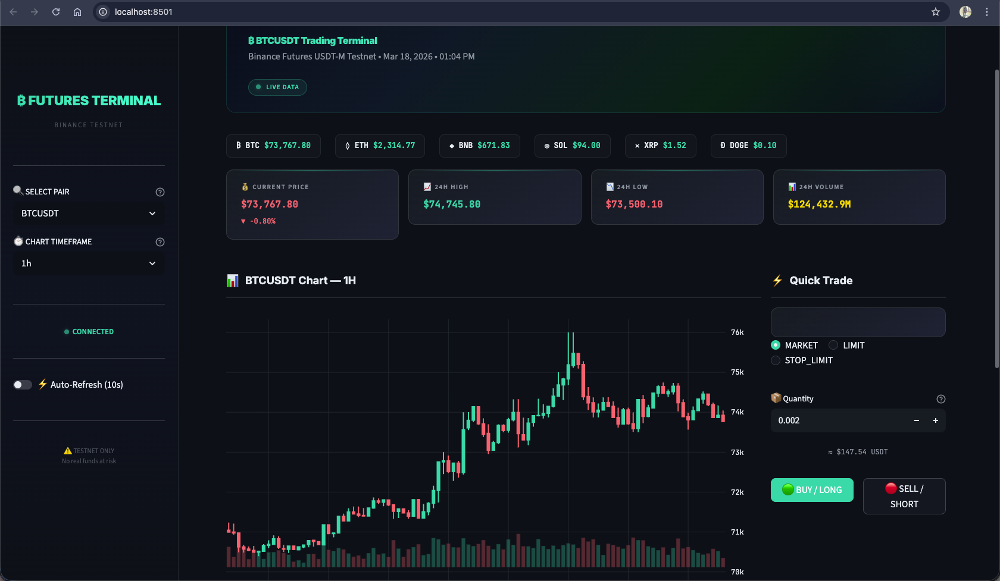
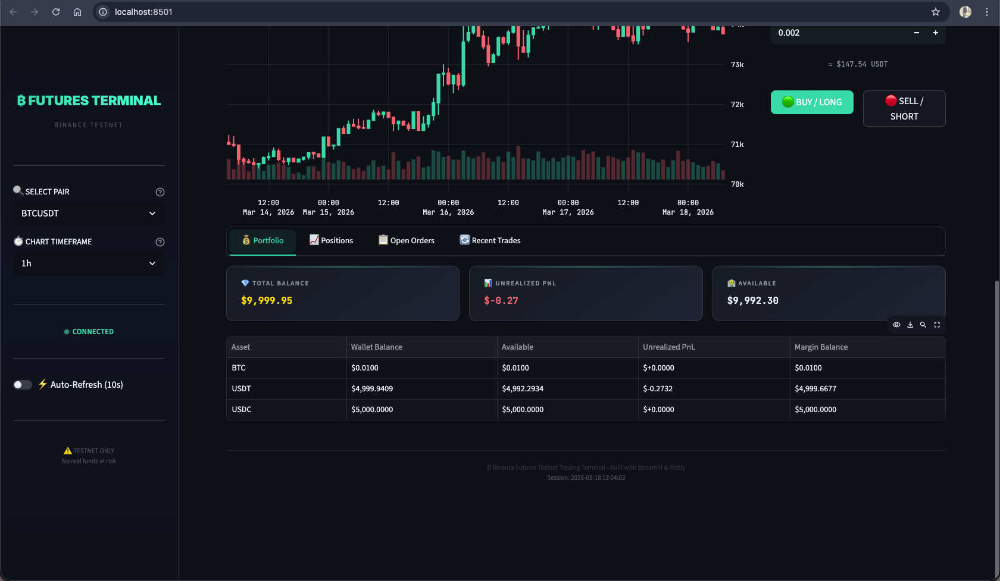

# ₿ Binance Futures Testnet — Trading Bot & Dashboard



A Python-based **Binance Futures USDT-M Testnet** trading application featuring a powerful **CLI** for order placement and a stunning **Streamlit dashboard** with real-time charts, portfolio tracking, and one-click trading.


---

## 🚀 Features

### 📊 Streamlit Trading Dashboard
A premium, dark-themed trading terminal built with Streamlit & Plotly:



- **Live Ticker Tape** — Real-time prices for BTC, ETH, BNB, SOL, XRP, DOGE
- **Interactive Candlestick Charts** — Powered by Plotly with volume overlays (1m → 1d timeframes)
- **Metric Cards** — Current price, 24h high/low, 24h volume with color-coded change indicators
- **Quick Trade Panel** — Place MARKET, LIMIT, and STOP_LIMIT orders with one click
- **Portfolio Overview** — Total balance, unrealized PnL, available margin, asset breakdown
- **Open Positions** — View all positions with entry price, leverage, direction, and live PnL
- **Order Management** — View open orders and cancel with one click
- **Recent Trades** — Latest market trades for any selected pair
- **Auto-Refresh** — Toggle live data refresh every 10 seconds
- **15 Supported Pairs** — BTCUSDT, ETHUSDT, BNBUSDT, and more

### ⌨️ Command-Line Interface (CLI)
A full-featured CLI for placing orders directly from the terminal:

- Place **Market**, **Limit**, and **Stop-Limit** orders
- Check API connectivity with `--ping`
- Fetch current prices with `--ticker`
- View account balances and positions with `--account`
- Comprehensive input validation and error handling
- Dual logging: console (INFO) + timestamped log files (DEBUG)

---

## 📁 Project Structure

```
trading_bot/
├── dashboard.py          # 📊 Streamlit dashboard (run with: streamlit run dashboard.py)
├── main.py               # ⌨️  CLI entry point (run with: python main.py)
├── requirements.txt      # Python dependencies
├── .env.example          # API credentials template
├── .env                  # Your actual API keys (git-ignored)
├── .gitignore
├── .streamlit/
│   └── config.toml       # Streamlit dark theme configuration
├── bot/
│   ├── __init__.py       # Package metadata
│   ├── config.py         # Loads API key/secret from .env
│   ├── client.py         # Binance REST API client (HMAC-SHA256 signing)
│   ├── orders.py         # Order placement logic & pretty formatting
│   ├── validators.py     # Input validation for all CLI parameters
│   └── logging_config.py # Dual logging: console + file
└── logs/                 # Auto-created; timestamped log per session
```

---

## 🛠️ Setup

### Prerequisites

- **Python 3.9+** (built with Python 3.13)
- A **Binance Futures Testnet** account
  → Sign up at [https://testnet.binancefuture.com](https://testnet.binancefuture.com)

### Installation

```bash
# Clone the repo
git clone https://github.com/nandinikhandelwal120603/binance-futures-bot.git
cd binance-futures-bot

# Create virtual environment
python3 -m venv venv
source venv/bin/activate      # macOS / Linux
# venv\Scripts\activate       # Windows

# Install dependencies
pip install -r requirements.txt
```

### Configure API Credentials

```bash
# Copy the template
cp .env.example .env

# Edit .env and add your testnet API key & secret
nano .env
```

Your `.env` should look like:

```env
BINANCE_API_KEY=your_actual_testnet_api_key
BINANCE_API_SECRET=your_actual_testnet_api_secret
```

---

## 📊 Running the Dashboard

```bash
source venv/bin/activate
streamlit run dashboard.py
```

The dashboard opens at **http://localhost:8501** with:

| Section | Description |
|---------|-------------|
| 🎯 **Ticker Tape** | Live prices for top 6 coins scrolling at the top |
| 📈 **Candlestick Chart** | Interactive chart with volume bars, multiple timeframes |
| ⚡ **Quick Trade** | Select order type → set quantity/price → BUY or SELL |
| 💰 **Portfolio** | Balance breakdown, unrealized PnL, available margin |
| 📋 **Open Orders** | View and cancel pending orders |
| 🔄 **Recent Trades** | Latest market activity for the selected pair |

### Dashboard Design

- **Dark terminal theme** — black/charcoal background with neon green accents
- **JetBrains Mono** monospace font for all financial numbers
- **Glassmorphism cards** with hover glow effects
- **Pulsing live indicator** for real-time data status
- **Responsive layout** — works on any screen size

---

## ⌨️ CLI Usage

All commands are run from the project directory with the virtual environment activated.

### Utility Commands

```bash
# Test API connectivity
python main.py --ping

# Get current price for a symbol
python main.py --ticker BTCUSDT

# View account balances & open positions
python main.py --account
```

### Placing Orders

```bash
# Market Order (executes immediately)
python main.py --symbol BTCUSDT --side BUY --type MARKET --quantity 0.002

# Limit Order (executes at specified price)
python main.py --symbol ETHUSDT --side SELL --type LIMIT --quantity 0.05 --price 3500

# Stop-Limit Order (triggers at stop price)
python main.py --symbol BTCUSDT --side SELL --type STOP_LIMIT \
    --quantity 0.002 --price 59000 --stop-price 60000
```

### CLI Options

| Flag | Short | Description |
|------|-------|-------------|
| `--symbol` | `-s` | Trading pair (e.g., `BTCUSDT`) |
| `--side` | | `BUY` or `SELL` |
| `--type` | `-t` | `MARKET`, `LIMIT`, or `STOP_LIMIT` |
| `--quantity` | `-q` | Amount to trade |
| `--price` | `-p` | Limit price (required for LIMIT/STOP_LIMIT) |
| `--stop-price` | | Stop trigger (required for STOP_LIMIT) |
| `--tif` | | Time in force: `GTC` (default), `IOC`, `FOK` |
| `--ping` | | Test API connectivity |
| `--ticker SYMBOL` | | Get current price |
| `--account` | | Show account balances & positions |
| `--log-level` | | `DEBUG`, `INFO`, `WARNING`, `ERROR` |

---

## 📝 Supported Symbols

`BTCUSDT` · `ETHUSDT` · `BNBUSDT` · `XRPUSDT` · `DOGEUSDT` · `SOLUSDT` · `ADAUSDT` · `AVAXUSDT` · `DOTUSDT` · `LINKUSDT` · `MATICUSDT` · `LTCUSDT` · `TRXUSDT` · `UNIUSDT` · `ATOMUSDT`

---

## 📋 Logging

Every CLI session creates a timestamped log file in `logs/`:

```
logs/trading_bot_20260318_121500.log
```

- **Console** → INFO-level messages (configurable with `--log-level`)
- **Log file** → DEBUG-level details including full API requests/responses

---

## ⚠️ Error Handling

| Error Type | Example |
|------------|---------|
| **Validation** | Invalid symbol, negative quantity, missing price for LIMIT |
| **API Errors** | Insufficient balance, min notional ($100), rate limits |
| **Network** | Connection timeouts, DNS failures |
| **Configuration** | Missing API key/secret |

---

## 🔒 Security

- **Never commit your `.env` file** — it's in `.gitignore`
- Configured for **testnet only** by default
- To switch to mainnet, update `BINANCE_BASE_URL` — **use extreme caution**

---

## 🧰 Tech Stack

| Technology | Purpose |
|-----------|---------|
| **Python 3.13** | Core language |
| **Streamlit** | Dashboard UI framework |
| **Plotly** | Interactive candlestick charts |
| **Pandas** | Data manipulation |
| **Requests** | HTTP API client |
| **HMAC-SHA256** | API request signing |
| **python-dotenv** | Environment variable management |

---

## 📄 License

This project is for educational purposes. Use at your own risk.

---

<p align="center">
  <b>Built by Nandini Khandelwal for the finance bros</b><br>
  <sub>₿ Trade smart. Trade testnet first.</sub>
</p>
